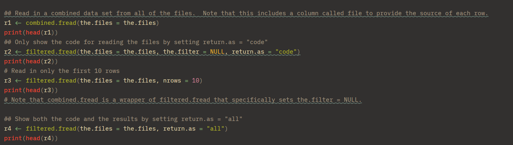

This week marks the official start of my work on **awkreader**! I am incredibly excited to finally dive into the code and start making contributions. 
The first week of any software project is always about getting your bearings, setting up the environment, and testing the waters. Here is a recap of what I have 
accomplished so far this week.

### 1. Setting Up the Package Structure 
I kicked off the week by setting up the foundational package structure. My mentor had provided some previous completions and groundwork, which made this 
process much smoother. Getting the environment properly configured is always a crucial first step...it ensures that everything else moving forward is built 
on a solid foundation. 

### 2. Deep Dive into the Vignette 
Before writing or modifying any code, I needed to understand what the package is currently doing under the hood. I spent a good chunk of time reading through 
the package **vignette**. 

This was super helpful for getting a high-level overview of the project. I familiarized myself with the core functions, the specific parameters they accept, and 
the expected outputs. Understanding the existing logic is key to making sure my future additions blend seamlessly with the current codebase.

### 3. Testing the Waters (and the Code!) 
With the structure set up and a better understanding of the package mechanics, it was time to test things out. I wanted to verify whether the existing example 
files were running properly.
I ran the code from the `example.R` file, which relies on the core functions housed in the main source file, `awkreader_v2.R`. To my absolute delight, everything 
ran perfectly fine! The package successfully generated the underlying `awk` commands and parsed the CSV data right into R data tables. 
Here are some queries from small part of `example.R` 
Here is a look at the console output showing the generated `awk` queries and the resulting filtered data:

There's no better feeling than running the source code and seeing a clean, successful execution without any unexpected bugs.

