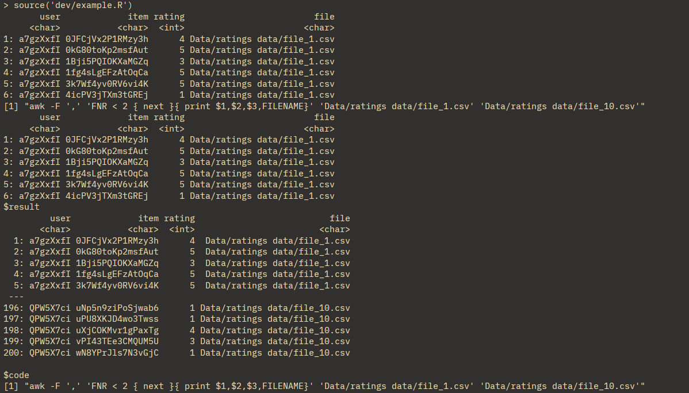

This week marks the official start of my work on **awkreader**! I am incredibly excited to finally dive into the code and start making contributions.

The first week of any software project is always about getting your bearings, setting up the environment, and testing the waters. Here is a recap of what I have accomplished so far this week.

---

## 1. Setting Up the Package Structure

I kicked off the week by setting up the foundational package structure. My mentor had provided some previous completions and groundwork, which made this process much smoother.

Getting the environment properly configured is always a crucial first step...it ensures that everything else moving forward is built on a solid foundation.

---

## 2. Deep Dive into the Vignette

Before writing or modifying any code, I needed to understand what the package is currently doing under the hood. I spent a good chunk of time reading through the package **vignette**.

This was super helpful for getting a high-level overview of the project. I familiarized myself with the core functions, the specific parameters they accept, and the expected outputs.

Understanding the existing logic is key to making sure my future additions blend seamlessly with the current codebase.

---

## 3. Testing the Waters (and the Code!)

With the structure set up and a better understanding of the package mechanics, it was time to test things out.

I wanted to verify whether the existing example files were running properly.

I ran the code from the `example.R` file, which relies on the core functions housed in the main source file, `awkreader_v2.R`.

To my absolute delight, everything ran perfectly fine! The package successfully generated the underlying `awk` commands and parsed the CSV data right into R data tables.

### Example Queries


### Console Output

Here is a look at the console output showing the generated `awk` queries and the resulting filtered data:



There’s no better feeling than running the source code and seeing a clean, successful execution without any unexpected bugs.

---

## 4. Moving to Actual Testing (and Catching Bugs!)

Now that the core functions were working locally on my machine, I needed to step it up.

I wanted to ensure the package runs perfectly across different operating systems like Linux (Ubuntu) and macOS.

To do this, I started writing formal unit tests using the `testthat` package, taking reference from the example testing files.

However, when I ran `test_that()`, I ran into three really interesting issues related to environments, our AWK translation engine, and data types.

---

## Issue 1: The `data.table` Awareness Trap (`cedta`)

::: {.callout-warning appearance="simple"}
### What Happened?

The moment my functions ran inside the isolated `testthat` environment, `data.table` threw a spectacular error regarding the assignment-by-reference operator:

```r
[:= called on a data.table in an environment that is not data.table-aware]
```
:::
**The Cause**

To optimize performance, data.table checks if a calling package environment is explicitly declared as "data.table aware" via its namespace (cedta).

Because our package didn't have compiled namespace directives yet, it safely fell back to standard data.frame evaluation, which doesn't understand :=.

**The Fix**

I added the explicit roxygen directive right above our function and re-ran devtools::document():
```r
#' @import data.table
```

This automatically injected the proper imports into our NAMESPACE, instantly making our environment cedta-compliant.

## Issue 2: The AWK Translation Engine Quoting Bug

::: {.callout-important appearance="simple"}

The Bug

While checking the generated AWK conditions, I noticed a flaw in how the engine handles mathematical functions.

The generated condition looked like this:

&& $3 > \"log($3)\"

In AWK, quoting a function turns it into a literal string comparison rather than executing the actual math function.
:::

**Short-Term Fix**

To get the CI pipeline green for now, I used: expect_match(..., fixed = TRUE) to account for the quotes in the test.

**Long-Term Goal**

As I refine the translation parser later, I need to update it so it strips quotes around native AWK functions.

Ideally, it should generate: if($2 == "sFFbD3fA0Jsvs7Ic" && $3 > log($3)) without the quotes.

## Issue 3: The fread Data Type Trap

::: {.callout-note appearance="simple"}

What I Learned

When awk filters and prints columns to standard output, it streams them as raw text tokens.

When data.table::fread() intercepts this text stream without any column headers to reference, it conservatively guesses the column type as character instead of numeric.
:::

This is dangerous because doing a greater-than comparison on characters behaves differently than on numbers.

For example:
```r
"10" < "2"
# TRUE
```
**Short-Term Fix**

I cast the data types explicitly inside the tests to pass the checks.

**Long-Term Goal**

I plan to update filtered.fread so it automatically preserves the original column types.

## 5. Green Checkmarks on GitHub Actions 

After applying the temporary fixes for those two issues, I pushed my code to GitHub. We don’t currently have any complete .Rd documentation or .Rmd vignettes, so the Continuous Integration (CI) pipeline only checked the tests folder.

To my relief, the tests ran on both Ubuntu and macOS environments and passed successfully! Seeing that green checkmark on GitHub Actions after figuring out those translation bugs was definitely the highlight of my week.

This week marks the official start of my work on awkreader! I am incredibly excited to finally dive into the code and start making contributions.

